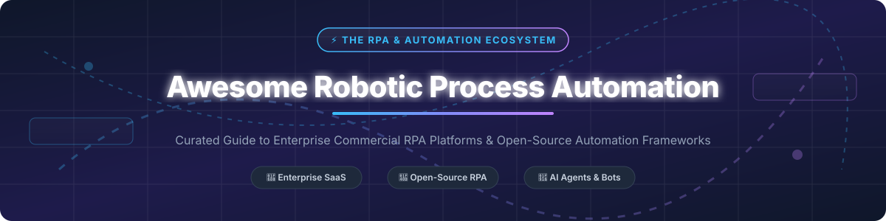

# 🤖 Awesome Robotic Process Automation (RPA) Ecosystem ⚡

     

> **Curated List of Commercial Enterprise SaaS Platforms & Open-Source GitHub RPA Frameworks**  
> *Focused on Software Robots, Intelligent Automation, AI Agents, Web & Desktop GUI Automation & Workflow Engines.*  

---

## 💡 Overview & Market Insights 📊

### 🌐 Sector Market Size & Market Structure
> 📈 The global **Robotic Process Automation (RPA)** and **Intelligent Automation market size** is estimated at **$16.2 Billion in 2026** (growing at a CAGR of ~38.2% toward $30+ Billion by 2030).  
> 🏛️ **Market Structure**: The sector is **moderately fragmented**, with a top-heavy enterprise tier led by mega-cap suites (Microsoft Power Automate, UiPath), while mid-market and developer tiers remain open to fast-growing AI-native agent platforms and open-source frameworks.

---

## 📑 Table of Contents 📌
- [🏢 SaaS & Commercial Enterprise Platforms](#-saas--commercial-enterprise-platforms)
- [🔓 Open-Source GitHub Repositories & Frameworks](#-open-source-github-repositories--frameworks)
- [🤝 How to Contribute](#-how-to-contribute)
- [⚠️ Security & Operational Disclaimer](#%EF%B8%8F-security--operational-disclaimer)
- [💖 Support & Sponsorship](#-support--sponsorship)
- [🌟 Star History](#-star-history)

---

## 🏢 SaaS & Commercial Enterprise Platforms 💼

Below is the comparative matrix of leading commercial RPA platforms, sorted by **Company Size / Valuation (Descending)** 📉.

| 🏢 Platform / Vendor | 📊 Valuation / Revenue | 💰 Pricing Tier (Specific Starting Price) | 🎁 Free Tier Limit / Free Trial Details | 🎯 Target Best For |
| :--- | :--- | :--- | :--- | :--- |
| **[Microsoft Power Automate](https://powerautomate.microsoft.com/)** ⚡ | **$3.84 Trillion** *(Market Cap)* | **$15** / user / month *(Premium)* or **$150** / bot / month *(Process)* | **30-Day Free Trial**; Free **Developer Plan** (unlimited non-production building/testing); basic desktop flows bundled in Win 11 | Enterprise Microsoft 365 / Dynamics ecosystem automation |
| **[UiPath](https://www.uipath.com/)** 🤖 | **$6.73 Billion** *(Market Cap)* | **$25** / user / month *(Basic)* or **$420** / month *(Flex Pro)* | **Free Forever Community Edition** (limited to 5 licenses, small business <$5M rev); **60-Day** full Enterprise Cloud Trial | Enterprise-wide end-to-end hyperautomation & AI document processing |
| **[Automation Anywhere](https://www.automationanywhere.com/)** 🚀 | **$6.80 Billion** *(Valuation)* | **$750** / bot / month *(Automation Cloud starter tier)* | **Free Forever Community Edition** (max 5 machines, 100 Document Automation pages/mo, <250 users); **30-Day** Enterprise Trial | Cloud-native intelligent automation & AI document bots |
| **[Pega RPA (Pegasystems)](https://www.pega.com/)** 🏛️ | **$5.58 Billion** *(Market Cap)* | **$200** / user / month *(Standard Pega Platform tier)* | **30-Day Free Trial** (Community Edition instance for learning & evaluation) | Enterprise CRM, case management & heavy workflow orchestration |
| **[Appian RPA](https://www.appian.com/)** 🧩 | **$2.63 Billion** *(Market Cap)* | **$90** / user / month *(Standard License)* | **Free Community Edition** (1 cloud dev instance for testing & app building) | Low-code process automation & case management |
| **[Nintex RPA](https://www.nintex.com/)** 📄 | **$2.00 Billion** *(Valuation)* | **$625** / month *(Standard Pro plan)* | **30-Day Free Trial** (Full access across Workflow & DocGen modules, no credit card required) | Business process management & automated document generation |
| **[Blue Prism (SS&C)](https://www.blueprism.com/)** 🛡️ | **$1.60 Billion** *(Acquired)* | **$1,200** / bot / month *(Enterprise license base)* | **180-Day Learning Edition** (Free study license, scheduler disabled); **30-Day** Cloud Trial | Highly regulated enterprise environments (Finance, Healthcare, Banking) |
| **[Kofax RPA (Tungsten)](https://www.kofax.com/)** 👁️ | **$750 Million** *(Est. Valuation)* | **$149** *(Perpetual Power PDF)* or **$500+** / mo *(TotalAgility)* | **15-Day Free Trial** (Power PDF & TotalAgility capture evaluation) | Cognitive document capture, OCR, and high-volume PDF workflows |
| **[WorkFusion](https://www.workfusion.com/)** 🕵️ | **$350 Million** *(Est. Valuation)* | **$1,500** / month *(Digital AI Worker base tier)* | **30-Day Free Trial** (Pre-built AI Digital Worker trial instance) | AI Digital Workers for banking compliance, AML & financial operations |

---

## 🔓 Open-Source GitHub Repositories & Frameworks 🐍

Below are top open-source RPA frameworks and automation libraries, sorted by **GitHub Stars_Count (Descending)** 🌟.

- **[microsoft/playwright](https://github.com/microsoft/playwright)**   
  **Fast, reliable end-to-end browser automation framework for Chromium, Firefox, and WebKit.** Supports headless mode, auto-waiting, network intercept, and full screen recording across Python, Node.js, Java, and .NET.

- **[SeleniumHQ/selenium](https://github.com/SeleniumHQ/selenium)**   
  **The original industry standard for browser automation.** Foundation for enterprise RPA web bots with support for all major operating systems and web browsers.

- **[asweigart/pyautogui](https://github.com/asweigart/pyautogui)**   
  **Cross-platform Python GUI automation module for human simulation.** Programmatically control mouse clicks, keypresses, and window actions on Windows, macOS, and Linux.

- **[robotframework/robotframework](https://github.com/robotframework/robotframework)**   
  **Generic keyword-driven open-source automation framework.** Plain-text syntax accessible to non-programmers with extensive Python library ecosystem for RPA.

- **[kelaberetiv/TagUI](https://github.com/kelaberetiv/TagUI)**   
  **Free flow-based RPA tool by AI Singapore.** Natural language syntax (e.g. `click button`, `type input`) with integrated OCR, web, and desktop automation on Windows, macOS, and Linux.

- **[tebelorg/RPA-Python](https://github.com/tebelorg/RPA-Python)**   
  **Python package for Robotic Process Automation (RPA).** Enables rapid web, desktop, and OCR automation using clean, minimal Python code built on TagUI core.

- **[open-rpa/openrpa](https://github.com/open-rpa/openrpa)**   
  **Open-source enterprise RPA platform.** Visual workflow designer with HD-robot orchestration, OpenFlow integration, support for web, desktop, remote desktop, and Java applications.

- **[robocorp/rpaframework](https://github.com/robocorp/rpaframework)**   
  **The de facto Python RPA stack (Apache 2.0).** Suite of open-source libraries for Robot Framework and Python covering SAP GUI, Excel, PDF, Email, Playwright, and Database automation.

- **[robotframework/SeleniumLibrary](https://github.com/robotframework/SeleniumLibrary)**   
  **Web testing and RPA library for Robot Framework.** Leverages Selenium WebDriver under the hood for keyword-driven browser automation scripts.

- **[robocorp/robocorp](https://github.com/robocorp/robocorp)**   
  **Python-based automation stack and developer tools.** Modern CLI, action server, and AI agent integration tools for building Python RPA bots.

- **[MarketSquare/robotframework-browser](https://github.com/MarketSquare/robotframework-browser)**   
  **Next-generation Playwright-powered Robot Framework library.** Offers ultra-fast, modern web page interaction and assertions for RPA pipelines.

- **[OakwoodAI/Automagica](https://github.com/OakwoodAI/Automagica)**   
  **Python open-source RPA library suite.** Combines PyAutoGUI, Selenium, PyWinAuto, and Tesseract OCR into a single Python interface for prototype automations.

- **[UiPath/ReFrameWork](https://github.com/UiPath/ReFrameWork)**   
  **Robotic Enterprise Framework template by UiPath.** Open-source architecture template for transactional RPA workflows with logging, exception handling, and retry mechanisms.

- **[rcktrncn/taskt](https://github.com/rcktrncn/taskt)**   
  **Free C# .NET desktop RPA client.** Features no-code drag-and-drop bot designer, screen recorder, element selector, and native Windows command runner.

---

## 🤝 How to Contribute 📝

Contributions are always welcome! 🚀 Follow these simple steps:

1. 🍴 **Fork** this repository.
2. ➕ **Add or edit** entries in `README.md` maintaining table/list structure and alphabetical or metric-based sorting.
3. 🔗 **Include** tool name, GitHub URL, clear description, pricing details, and Stars_Count badge.
4. 📬 **Submit** a Pull Request with a clear summary of your updates.

---

## ⚠️ Security & Operational Disclaimer 🛡️

- 🤖 **Privilege Awareness**: RPA bots execute actions with full operating system and application permissions. Ensure strict **Least Privilege Access** and run bots in sandbox environments.
- 🔐 **Credential Management**: Never hardcode API keys or passwords in scripts. Utilize secure vaults (Vault, OS Keychains, environment variables).
- ⚖️ **Compliance**: Commercial names and trademarks belong to their respective corporate owners.

---

## 💖 Support & Sponsorship ☕

Thank you for exploring and utilizing this Robotic Process Automation repository! If you find this curated list helpful for your enterprise automation, workflow design, or developer projects, please consider supporting the project:

- ⭐ **Star** this repository on GitHub to increase visibility.
- 🍴 **Fork** and contribute new RPA tools, software, or open-source libraries.
- 📢 **Share** it with fellow automation engineers and developers.
- ☕ **Buy me a coffee / Sponsor**: If you'd like to support ongoing open-source maintenance, feel free to sponsor via [GitHub Sponsors](https://github.com/sponsors/ishandutta2007)!

---

## 🌟 Star History

---

  <b>⭐ Star this repo if you find it helpful for your Robotic Process Automation journey! ⭐</b>

